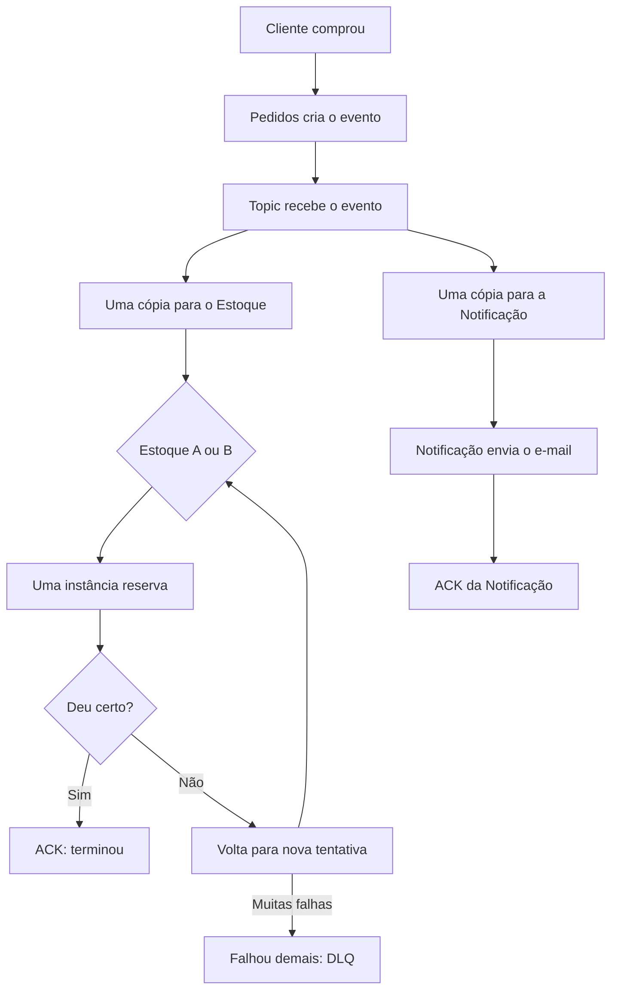

# Google Pub/Sub

## Visão geral
Abaixo encontra-se uma breve descrição sobre os principais tópicos utilizados do Google Pub/Sub.

- - -

### Producer
O **producer**, ou publicador, é quem produz a mensagem.

No nosso exemplo, é o serviço de pedidos. Depois de aceitar a compra, ele publica um evento `OrderPlaced`.

Uma vantagem importante é que o producer não precisa conhecer todos os interessados. Ele publica no tópico sem chamar diretamente Estoque ou Notificação.

- - -

### Mensagem
A mensagem é o envelope transportado pelo Pub/Sub. Ela normalmente contém:
- Dados do evento, como identificador do pedido, data e itens.
- Um identificador único do evento.
- Metadados, como versão do evento ou identificador de correlação.

Inicialmente, pense nela como uma declaração pequena e objetiva sobre algo que aconteceu, não como uma cópia completa do banco de dados.

- - -

### Topic
O **topic** é o canal no qual mensagens de determinado contexto são publicadas.

Ele não é a caixa de entrada do consumidor. É mais parecido com uma estação de rádio: o produtor transmite pelo canal, e diferentes assinaturas decidem receber aquela transmissão.

Neste laboratório poderíamos ter conceitualmente um tópico de eventos relacionados a pedidos.

- - -

### Subscription 
A **subscription** é a caixa de entrada ligada a um tópico.

Essa diferença é fundamental:
- Cada subscription recebe sua própria cópia lógica das mensagens.
- Estoque e Notificação precisam de subscriptions separadas.
- Se houver três instâncias do serviço de Estoque consumindo a mesma subscription, elas dividem o trabalho dessa caixa de entrada; as três não deveriam processar individualmente cada mensagem.

Portanto:
- **Subscriptions diferentes:** distribuição do mesmo evento para finalidades diferentes.
- **Vários consumidores na mesma subscription:** divisão de carga para a mesma finalidade.

- - -

### Consumer
O **consumer**, ou subscriber, lê e processa a mensagem.

Ao receber `OrderPlaced`:
- Estoque tenta reservar os produtos.
- Notificação envia a confirmação ao cliente.
- Analytics poderia registrar a conversão.

Cada consumidor evolui e escala de maneira independente.

- - -

### Pull e Push
No modelo **pull**, o consumidor procura mensagens na subscription. Ele mantém o controle sobre quando e quantas mensagens consegue processar.

No modelo **push**, o Pub/Sub envia a mensagem para um endereço HTTP do consumidor.

No dia a dia:
- Pull é comum em workers e serviços Go executados continuamente.
- Push combina bem com serviços HTTP gerenciados, como Cloud Run.
- Para o laboratório, começaremos com pull porque facilita observar o recebimento, o processamento e a confirmação da mensagem.

- - -

### Ack, falhas e at-least-once delivery
Depois de processar uma mensagem, o consumidor envia um **acknowledgment**, ou `ack`, dizendo: “terminei com sucesso”.

Se o consumidor:
- Falhar;
- Rejeitar a mensagem;
- Ou não confirmar dentro do prazo;

a mensagem poderá ser entregue novamente.

Isso leva à garantia **at least once**: o Pub/Sub procura entregar uma mensagem pelo menos uma vez, mas ela pode chegar mais de uma vez.

Exemplo crítico:
1. O Estoque reserva os produtos.
2. O processo cai antes de enviar o `ack`.
3. O Pub/Sub entrega novamente o mesmo `OrderPlaced`.
4. Sem proteção, o Estoque pode fazer uma segunda reserva.

Por isso, consumidores precisam ser **idempotentes**: processar novamente o mesmo evento não pode produzir um segundo efeito indevido. No futuro, faremos isso reconhecendo o identificador do evento ou protegendo a operação por uma restrição única.

- - -

### Dead Letter Queue
Algumas mensagens continuam falhando mesmo após várias tentativas: formato inválido, dado incompatível ou erro inesperado de negócio.

Uma **Dead Letter Queue**, no Pub/Sub implementada por meio de um dead-letter topic, recebe essas mensagens problemáticas depois de uma quantidade configurada de tentativas.

Ela não é uma lixeira. É uma área de diagnóstico e recuperação:
- Investigar por que a mensagem falhou.
- Corrigir o problema.
- Decidir se ela deve ser reprocessada.

O emulador suporta esse fluxo, embora não reproduza perfeitamente todos os comportamentos do serviço real.

- - -

